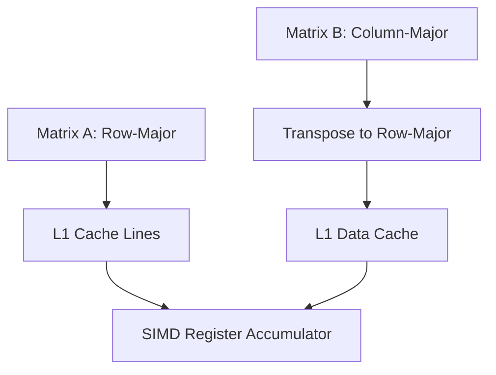

## Introduction

General Matrix Multiply (GEMM) is the computational core of modern deep learning frameworks. In this post, we discuss micro-architectural optimizations for GEMM, analyzing cache blocking and SIMD vectorization under the Roofline model.

<div class="admonition tip">
  <div class="admonition-title">Optimization Tip</div>
  Always align matrix allocations to 64-byte boundaries to prevent cache line splits during SIMD vector operations.
</div>

## Theoretical Bound

For a naive triple-loop matrix multiplication of two $N \times N$ matrices, the arithmetic complexity is $2N^3$ floating-point operations. The data read complexity is $O(N^2)$ elements, which results in a low operational intensity if data is thrashed continuously from main memory.

The core equation representing the multiplication is:

$$ C_{ij} = \sum_{k=1}^{N} A_{ik} B_{kj} $$

Using block size $B$, we partition the matrix so that block sub-matrices fit in the L2 and L1 caches:

$$ B \approx \sqrt{\frac{C_{\text{L1}}}{3 \times \text{sizeof}(float)}} $$

## Memory Layout and Cache Blocking

To avoid cache misses, the memory layout must support sequential reads. By transposing Matrix $B$ before loop operations, we convert column access to row access, converting pointer jumps into sequential strides.



<figcaption>Figure 1: Cache locality and transposition flow chart</figcaption>

## Loop Intrinsics Optimization

Below is the optimized inner loop implementation using AVX2 intrinsics:

```cpp
#include <immintrin.h>

void gemm_kernel_avx2(const float* A, const float* B, float* C, int N) {
    // Accumulate in 256-bit YMM registers (8 floats per register)
    __m256 c0 = _mm256_setzero_ps();
    for (int k = 0; k < N; k++) {
        __m256 a = _mm256_set1_ps(A[k]);
        __m256 b = _mm256_loadu_ps(&B[k * N]);
        c0 = _mm256_fmadd_ps(a, b, c0);
    }
    _mm256_storeu_ps(C, c0);
}
```

## Performance Comparison

Local benchmarks on $1024 \times 1024$ single-precision float matrices show substantial speedups:

| Kernel Variant | Execution Time (ms) | Attained GFLOPs/sec |
| :--- | :--- | :--- |
| Naive Triple Loop | 2840 ms | 0.75 |
| Transposed $B$ | 480 ms | 4.47 |
| **AVX2 + Transposed (O3)** | 28 ms | 76.62 |

> Blocked algorithms achieve high cache hits by reusing data lines inside registers [[^1]]. This is critical for preventing compute cores from starving while waiting for memory access.

## Conclusion

Optimizing numerical kernels requires aligning computational intensity with target cache hierarchies. In our next article, we will examine the impact of parallel communication frameworks in distributed training.

[^1]: Williams, S., Waterman, A., & Patterson, D. (2009). Roofline: An Insightful Visual Performance Model for Multicore Architectures. *Communications of the ACM*.
