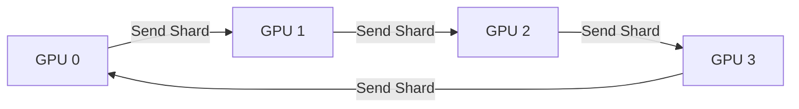

## Introduction

As deep learning models scale, a single accelerator is no longer sufficient to hold model parameters or batch activations. This post analyzes Data Parallelism and compares communication costs in collective communication, specifically the **Ring All-Reduce** protocol.

<div class="admonition warning">
  <div class="admonition-title">Network Bottleneck Warning</div>
  In distributed settings, inter-node network bandwidth (e.g., InfiniBand vs. Ethernet) is often the primary bottleneck, rather than raw compute capability.
</div>

## Theoretical Framework

Data Parallelism replicates model weights across $P$ nodes. Each worker processes a distinct shard of the batch and calculates local gradients. Collective communication aggregates these gradients to compute global weight updates:

$$ G_{\text{global}} = \frac{1}{P} \sum_{i=1}^{P} G_i $$

In a naive parameter server architecture, communication bandwidth scales poorly as the number of nodes increases. The Ring All-Reduce algorithm reduces gradients in a logical ring, keeping network bandwidth constant.



<figcaption>Figure 1: Ring communication topology between GPU nodes</figcaption>

## Communication Cost Analysis

For a model with $M$ parameters, the Ring All-Reduce algorithm executes in two phases: Scatter-Reduce and All-Gather. In each phase, workers transmit $M/P$ parameters over $P-1$ steps. The total volume of data transmitted per GPU is:

$$ V = 2 \left( \frac{P - 1}{P} \right) M $$

This demonstrates that the communication cost is independent of the number of processors $P$, scaling only with model parameters $M$ [[^1]].

## Implementation Snippet

Below is a conceptual MPI collective reduction kernel representing the Scatter-Reduce phase:

```cpp
#include <mpi.h>
#include <vector>

void scatter_reduce(std::vector<float>& buffer, int rank, int size) {
    int segment_size = buffer.size() / size;
    int send_to = (rank + 1) % size;
    int recv_from = (rank - 1 + size) % size;

    for (int step = 0; step < size - 1; step++) {
        int send_index = ((rank - step + size) % size) * segment_size;
        int recv_index = ((rank - step - 1 + size) % size) * segment_size;

        MPI_Sendrecv(
            &buffer[send_index], segment_size, MPI_FLOAT, send_to, 0,
            &buffer[recv_index], segment_size, MPI_FLOAT, recv_from, 0,
            MPI_COMM_WORLD, MPI_STATUS_IGNORE
        );
    }
}
```

## Benchmarks & Bandwidth Scaling

Benchmarks comparing inter-node gradient synchronization times for varied topologies on 100M parameter updates ($M \approx 400$ MB):

| Nodes ($P$) | Topology | Bandwidth (GB/s) | Sync Time (ms) |
| :--- | :--- | :--- | :--- |
| 4 | Parameter Server | 1.2 GB/s | 333 ms |
| 4 | **Ring All-Reduce** | 9.8 GB/s | 40.8 ms |
| 8 | Parameter Server | 0.6 GB/s | 666 ms |
| 8 | **Ring All-Reduce** | 9.5 GB/s | 42.1 ms |

> Under Ring All-Reduce, doubling the cluster size from 4 to 8 nodes does not degrade communication bandwidth, illustrating why it is the default backend for deep learning scaling engines [[^2]].

## References

[^1]: Gibiansky, A. (2017). Bringing HPC Techniques to Deep Learning. *Baidu Research Technical Report*.
[^2]: Sergeev, A., & Del Balso, M. (2018). Horovod: Fast and Easy Distributed Deep Learning in TensorFlow. *arXiv preprint arXiv:1802.05799*.
