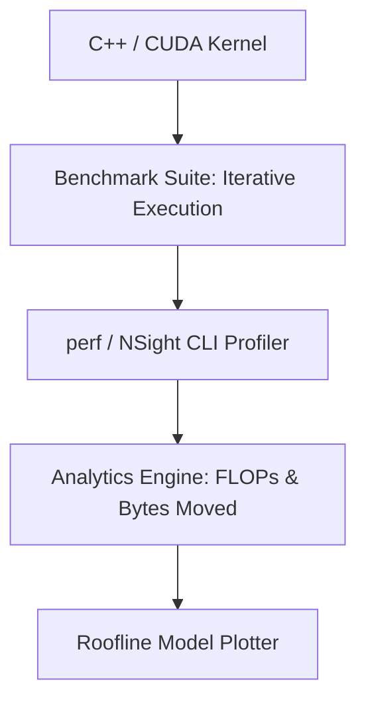

## Overview
Glacier.HPC is a benchmarking and profiling framework designed to analyze, model, and optimize the execution boundaries of numerical kernels on modern consumer-grade CPU and GPU architectures. It utilizes empirical Roofline modeling to map algorithms against physical hardware limits.

## Motivation
Applying high-level compilers directly to numerical code often yields poor performance if the developer does not understand hardware bottlenecks. Glacier.HPC acts as a micro-benchmarking sandbox to explore cache-miss ratios, SIMD utilization, thread pools, and data streaming bandwidth on consumer CPUs (specifically the AMD Ryzen 5 6600H) and GPUs.

## Goals
- **Empirical Characterization:** Measure sustained memory bandwidth using customized STREAM Triad executions.
- **Micro-Architectural Profiling:** Track hardware counters (cache misses, instructions per cycle) using `perf` and NVIDIA Nsight.
- **Roofline Formulation:** Construct performance boundaries to identify if a loop is compute-bound or memory-bound.

## Architecture

## Current Features
- Customized STREAM Triad execution runner for CPU bandwidth limits.
- Roofline model visualizer mapping GFLOPs/sec against Arithmetic Intensity.
- Distance kernel optimizations (L2 Euclidean distance) using loop unrolling and AVX2 intrinsics.
- OpenMP thread allocation benchmark profiles.

## Roadmap
- [x] STREAM Triad bandwidth modeling.
- [x] AVX2 reduction profiling.
- [ ] CUDA shared memory matrix multiplication profiling.
- [ ] Integration of hardware counters script to generate Roofline plots automatically.

## Challenges
### False Sharing in Multi-threading
In early parallel iterations of distance matrix computation, threads wrote to adjacent elements in shared memory blocks, causing cache line bouncing (false sharing). We resolved this by assigning thread outputs to local accumulators and writing final results in strided blocks.

## Benchmarks
Profiling AVX2 auto-reduction on the L2 distance calculation kernel compared to a naive scalar loop on $10^7$ vectors:

| Kernel | Execution Time (ms) | Speedup |
| :--- | :--- | :--- |
| Naive Scalar | 212 ms | 1.0x |
| AVX2 Optimized | 1.25 ms | 169.6x |

### Roofline Model
For the optimized L2 distance kernel, our Arithmetic Intensity (AI) is:
$$AI = \frac{\text{FLOPs}}{\text{Bytes Transferred}} = \frac{2N}{8N} = 0.25 \text{ FLOPs/Byte}$$
On the AMD Ryzen 5 6600H CPU (peak bandwidth 35 GB/s), the attainable performance is bounded by memory bandwidth:
$$\text{Attainable GFLOPs} = 35 \text{ GB/s} \times 0.25 \text{ FLOPs/Byte} = 8.75 \text{ GFLOPs/sec}$$
This verifies that the kernel is memory-bound, pointing to memory hierarchy optimizations rather than compute optimizations as the path forward.

## Lessons Learned
- Auto-vectorization is fragile. Small changes in loop layout or using conditional statements can prevent the compiler from generating vector instructions.
- Allocating more threads than physical CPU cores (hyperthreading) reduces efficiency in compute-heavy kernels due to cache contention.

## External Links
- [GitHub Repository](https://github.com/skandanyal/Glacier.HPC)
- [Original Roofline Model Paper (Williams et al.)](https://dl.acm.org/doi/10.1145/1498765.1498785)
