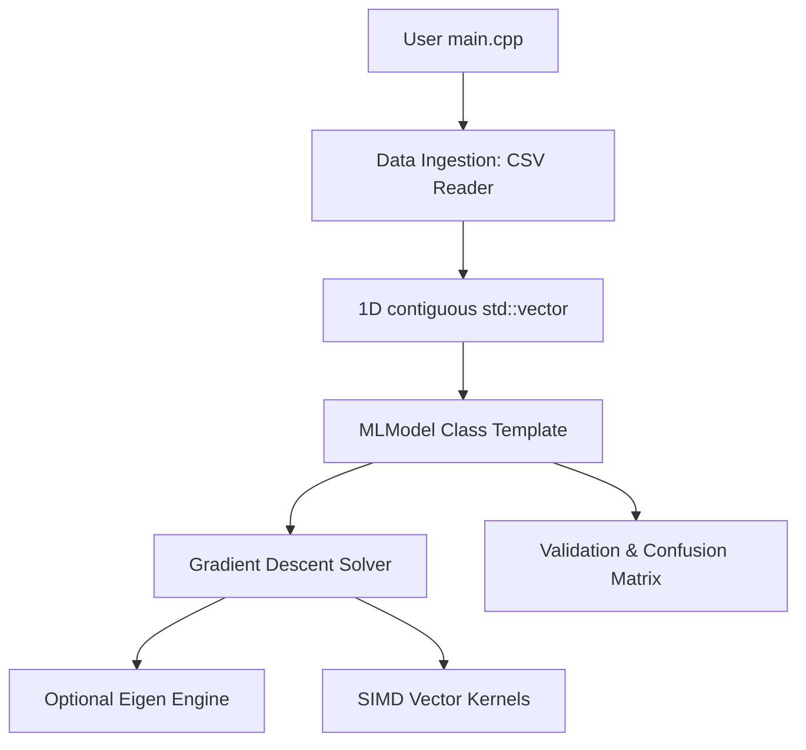

## Overview
Glacier.ML is a header-only numerical algorithms library written in C++20. It allows building, training, and evaluating machine learning models (such as Linear and Logistic Regression) from first principles, emphasizing low-level hardware control, explicit memory layouts, and zero-overhead abstractions.

## Motivation
Modern machine learning models are typically built using high-level frameworks (e.g., PyTorch, TensorFlow, Scikit-learn) that encapsulate numerical operations. This abstraction hides the systems-level bottlenecks, such as memory bandwidth limitations, cache hierarchies, and floating-point stability constraints. Glacier.ML was developed to translate multivariate statistical theory into direct, hardware-aware implementations.

## Goals
- **Zero Abstraction Overhead:** Build minimal, explicit compilation paths where compilers can optimize math loops cleanly.
- **Hardware-Aware Design:** Flat data layouts to enable spatial locality and SIMD vectorization.
- **Header-Only Portability:** Simple integration without complex external builds or linking.

## Architecture

## Current Features
- Contiguous 1D layout representation of data matrices to reduce cache misses.
- Linear Regression (Simple & Multiple variables).
- Binary Logistic Regression with cross-entropy loss.
- Ingestion pipelines supporting CSV files directly to raw C++ float layouts.
- Confusion matrix and evaluation utilities.

## Roadmap
- [x] Contiguous 1D layout integration.
- [x] AVX2 vectorization support.
- [ ] Multithreaded solvers using OpenMP.
- [ ] CUDA-accelerated mini-batch solvers.

## Challenges
### Floating-Point Stability
In early iterations, logistic regression suffered from floating-point overflow/underflow when computing sigmoid bounds on large inputs. 
$$S(z) = \frac{1}{1 + e^{-z}}$$
To address this, we implemented stable bounds limiting $z$ and clipping probabilities to $[10^{-7},\; 1 - 10^{-7}]$ before cross-entropy evaluation.

## Benchmarks
In local testing against scikit-learn's Logistic Regression on the Pima Indians Diabetes Dataset ($768 \times 9$ elements), Glacier.ML achieved comparable accuracy and training speed despite lacking thread pools:

| Implementation | CPU Time (ms) | Accuracy |
| :--- | :--- | :--- |
| Scikit-learn (L-BFGS) | 12.4 ms | 77.2% |
| **Glacier.ML (SGD)** | 14.8 ms | 76.9% |

## Lessons Learned
- Nested vectors (`std::vector<std::vector<T>>`) perform poorly due to pointer chasing and cache thrashing. Flat arrays are necessary for numerical computing.
- IEEE 754 precision issues are common during gradient updates and require careful clipping.

## External Links
- [GitHub Repository](https://github.com/skandanyal/Glacier.ML)
- [Glacier.HPC Profiling Logs](https://github.com/skandanyal/Glacier.HPC)
